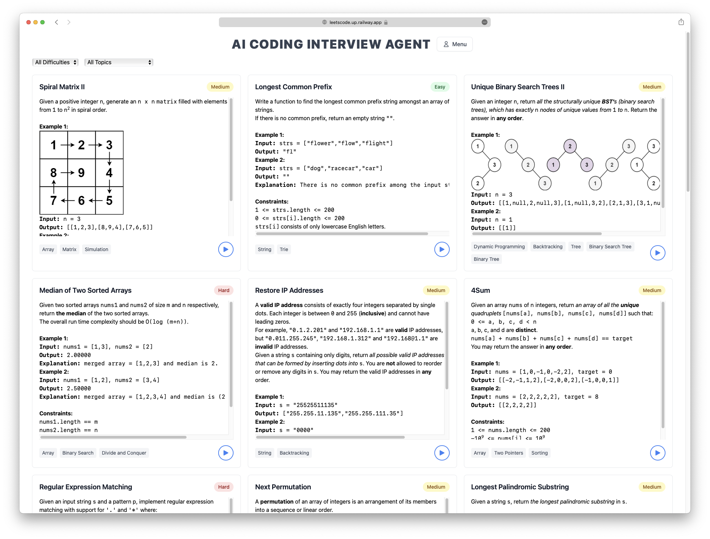
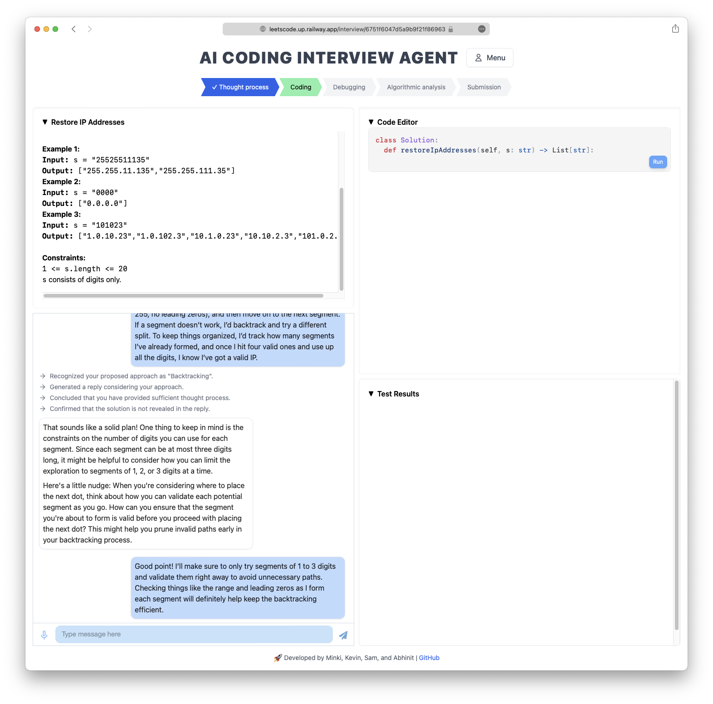
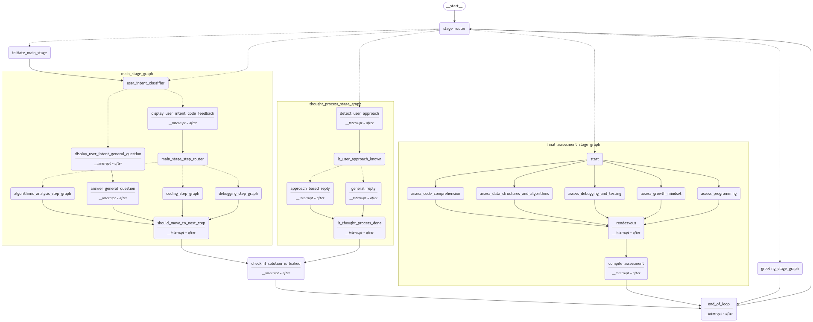
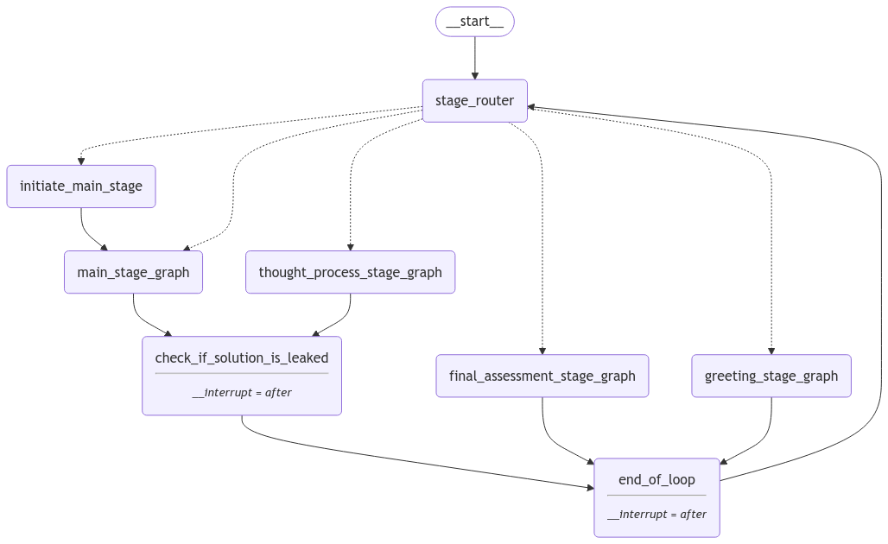

# AI Mock Coding Interview Agent

An intelligent AI-powered coding interview simulator that provides a realistic interview experience with adaptive feedback and comprehensive assessment.
This project was part of the LLM Agents Hackathon organized by Berkeley as part of their MOOC course ["Large Language Model Agents."](https://llmagents-learning.org/f24)

## 🚀 Live Demo
Try the application here: [Link](https://leetscode.up.railway.app)

## 📸 Screenshots

### Home Page


### Interview Page


## 🏗️ Architecture

### System Overview


### High-level Architecture


## 🛠️ Tech Stack

### Frontend
- **React** - Modern UI framework with Vite for fast development
- **TailwindCSS** - Utility-first CSS framework
- **ChatScope** - UI components for chat interface
- **Google OAuth** - Secure authentication

### Backend
- **FastAPI** - High-performance Python web framework
- **MongoDB** - NoSQL database for flexible data storage
- **Docker** - Containerization and deployment
- **LangChain** - Framework for LLM orchestration
- **LangGraph** - Library for complex agentic workflows

## 🚀 Getting Started

### Prerequisites
- Docker and Docker Compose
- Node.js (for local development)
- Python 3.11+ (for local development)
- MongoDB (for local development)

### Environment Setup
1. Clone the repository
2. Create `.env` files in both `/backend` and `/frontend` directories
3. Configure the environment variables according to the templates

### Quick Start with Docker
Run the entire application stack with a single command:

```bash
docker compose up --build -d
```
The application will be available at:
- Frontend: `http://localhost:3001`
- Backend: `http://localhost:8000`

## 🤝 Contributing
Contributions are welcome! Please feel free to submit a Pull Request.

## 🙏 Acknowledgments
- LangChain team for their outstanding frameworks.
- Berkeley LLM Agent MOOC team for organizing this hackathon.
- OpenAI for their free API credits.
